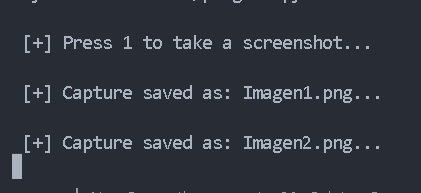
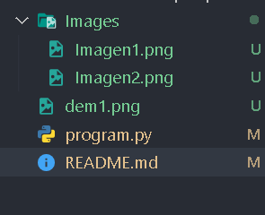

# Capturador de Pantalla

Proyecto #2 con Python. Toma capturas de pantalla automáticamente.

## Funcionamiento

Al ejecutar el programa:

1. **Presiona la tecla 1** para tomar una captura de pantalla completa
2. **La imagen se guarda** automáticamente en la carpeta `Images/` dentro del directorio del programa
3. Puedes tomar múltiples capturas, cada una se guardará con un nombre único

## Características

- **Captura de pantalla completa**: Captura toda la pantalla visible
- **Guardado automático**: Las imágenes se guardan en la carpeta de imágenes
- **Nombrado automático**: Cada captura recibe un nombre único

## Imágenes de Ejemplo

Imagen 1

Imagen 2

---

> Autor: Fravelz
