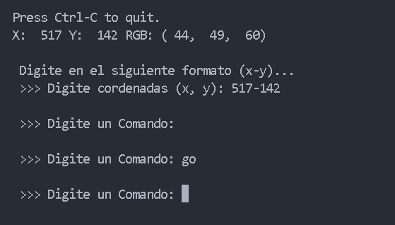
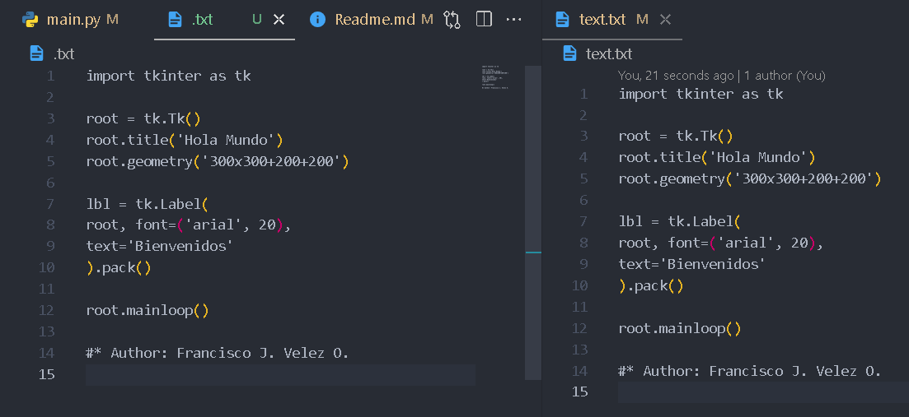

# Script de Escritura Automática

Proyecto #4 con Python. Código para escribir automáticamente en cualquier lugar de la pantalla.

## Cómo Usar el Código

> Instala la librería **"pyautogui"**

```bash
pip install pyautogui
```

### Pasos para ejecutar

1. **Cuando inicia el programa**, se muestran las coordenadas del cursor
2. **Abre el programa y mueve el cursor** al lugar donde deseas escribir
3. **Presiona las teclas (Ctrl + C)** para pausar
4. **Introduce las coordenadas** del lugar donde quieres que escriba
5. **El programa te pedirá un comando**. Tienes dos opciones por defecto:
   - Escribe `1` → escribirá "¡Hola Mundo!"
   - Escribe `go` → escribirá el contenido del archivo `text.txt`

### Personalizar comandos

Puedes modificar el archivo para agregar tus propias opciones y textos personalizados.

## Imágenes de la Interfaz Gráfica

**Imagen 1:**



**Imagen 2:**



---

> Autor: Fravelz
