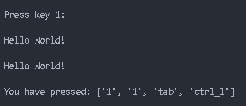

# Registrador de Teclas (KeyLogger)

Proyecto #3 con Python. Script para capturar las teclas presionadas seleccionadas.

## Funcionamiento

Cuando ejecutas el archivo:

1. **El programa imprime en la consola** el texto: "Presiona una tecla: "
2. **Después de presionar una tecla**, se imprime otro mensaje
3. **Puedes modificar** las acciones para realizar eventos según la tecla presionada

## Características Principales

- **Monitoreo de teclas**: Captura cada tecla que presionas
- **Tecla ESC para finalizar**: Al presionar ESC, imprime en formato de lista todas las teclas capturadas
- **Personalizable**: Modifica el código para ejecutar acciones específicas según cada tecla

## Imágenes de Ejemplo

Imagen 1

---

> Autor: Fravelz
