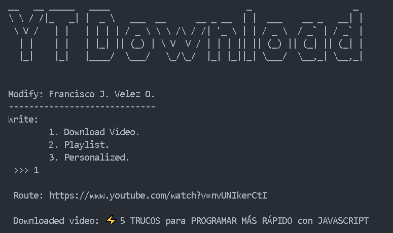
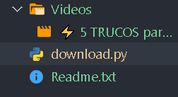

# Descargador de Videos de YouTube

Proyecto #1 con Python. Descarga videos directamente desde YouTube.

## Cómo Usar el Código

Cuando ejecutas el código:

1. **El programa imprime las opciones disponibles**
2. **Ingresa el número de la opción** que deseas utilizar
3. **Proporciona la información solicitada** (URL del video, etc.)
4. **Espera mientras descarga** el video desde YouTube

El programa te guiará a través de un menú interactivo con las opciones disponibles.

## Imágenes de la Interfaz Gráfica

Imagen 1

Imagen 2

---

> Autor: Fravelz
